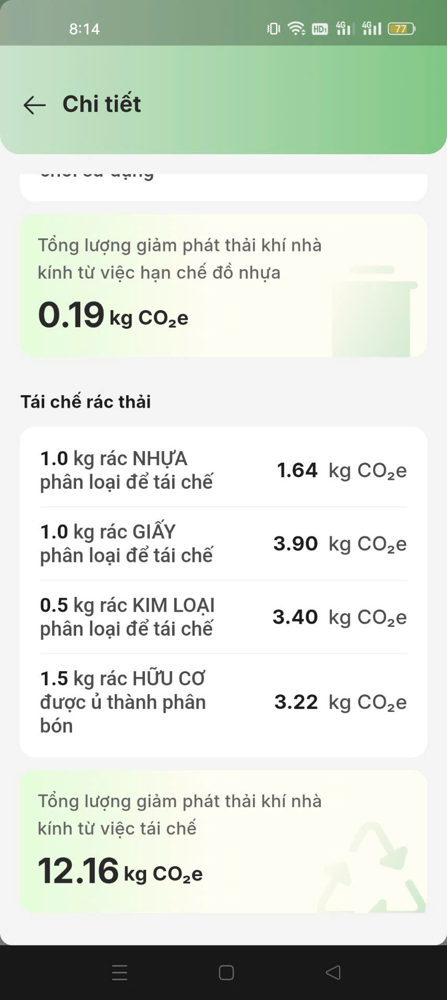

# WazNet
<!--   -->
<p align="center">
  
</p>

**WazNet** (Waste zero, Net zero) is a mobile app that helps users track their contributions to greenhouse gas reduction.

A product of SPARC Lab (HUST) and CECR. Available on [App Store](https://apps.apple.com/vn/app/waznet/id6738925384) and Google Play.

## Tech stacks
- Mobile app built with Flutter
- Supported platforms: **Android**, **iOS**
- State management with Bloc
- Push Notifications via FCM
- Back-end systems using Elixir, RabbitMQ, Redis, PostgreSQL
- Build and deploy using Docker
- Publish to App Store (iOS), Play Console (Android) using Github Actions

## Features
- 3 roles: Admin, Household, Scraper
- Scrapers and Households contribute garbage/recycle quantity data, app will calculate to **kgCO2e** reduction
- Admin can track all contributions, export Excel statistic(upcoming)
- Others can track own contributions, receive notifications to remind contribute in custom time 

<details>
<summary>Screenshots</summary>

### Login/Register
| Login                                             | Register                                              |
|---------------------------------------------------|-----------------------------------------------------|
|                |  |

### Home
| Admin                                             | Household                                               |
|---------------------------------------------------|-----------------------------------------------------|
|           |  |

### Contribution input
| Input                                             | Input                                               |
|---------------------------------------------------|-----------------------------------------------------|
|       |  |

### Contribution detail
| Detail                                            | Detail                                               |
|---------------------------------------------------|-----------------------------------------------------|
|       |  |

### User info
| User Info                                            |
|---------------------------------------------------|
|     | 
</details>

## Installing

Google Play:
- Closed Beta Testing (send email address to email in contact)
- Waiting to be published

App Store:
- [TestFlight](https://testflight.apple.com/join/9wRutKJ9)
- [App Store](https://apps.apple.com/vn/app/waznet/id6738925384)


## Building
Project is using git-crypt to encrypt all credentials, contributors need to contact to repo's owner to get decryption key.

Install `git-crypt`: [MacOS, Ubuntu](https://github.com/AGWA/git-crypt/blob/master/INSTALL.md), [Windows](https://github.com/AGWA/git-crypt/releases/tag/0.7.0)

After saving key somewhere in your directory, command:
```bash
git-crypt unlock <path_to_key>
```
If all files are decrypted, done! You can run code normally.

## Roadmap
- iOS/Android Push Notification
- Custom time schedule for sending reminder notification to users
- ZNS to forgot password flow (on my way to find another solution)
- Export Excel statistics

## Contact
Email: sparc.hust@gmail.com

Email: thai.dm279@gmail.com
